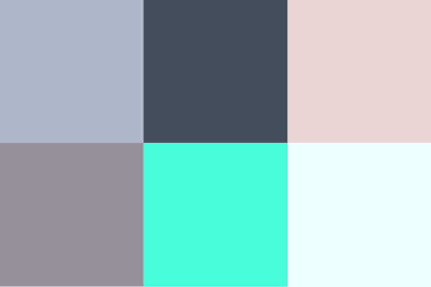

### ***Cores usadas para o projeto (HEX):
    - Cinzento Semi-claro `#9fa9bf`
    - Cinzento Escuro `#333c4a`
    - Beige Claro `#e5caca`
    - Cinzento Beige `#838087` 
    - Prismarino `#4DFED1`
    - Branco Azulado `#E9FFFF`***

